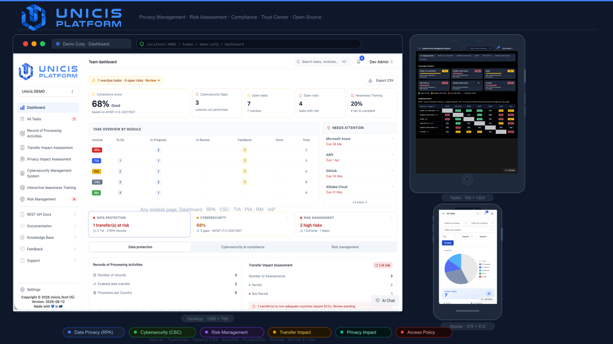

<picture>
  <source media="(prefers-color-scheme: dark)" srcset="https://www.unicis.tech/img/logo_unicis_white-1.svg">
  <source media="(prefers-color-scheme: light)" srcset="https://www.unicis.tech/img/unicis-platform-logo-horizonatal.svg">
  
</picture>

# ⭐️ Unicis Platform Community (free and open source)


Unicis Platform Community Edition - an open core, enterprise-ready trust management platform for startups and SMEs. Built for CISOs, DPOs, DevSecOps, and compliance teams who need one place to manage privacy, cybersecurity controls, and risk.

Please star ⭐ the repo if you want us to continue developing and improving the Unicis Platform! 😀

<p align="center">
  
</p>

## 🗄️ Available Frameworks and Standards

<p align="center">
  
  
  
  
  
  
  
  
  
  
  
</p>

- [General Data Protection Regulation - GDPR](https://www.unicis.tech/frameworks/gdpr?mtm_campaign=GitHub%20readme)
- [Minimum Viable Secure Product - MVSP](https://www.unicis.tech/frameworks/mvsp?mtm_campaign=GitHub%20readme)
- [ISO 27001:2013 & ISO 27001:2022](https://www.unicis.tech/frameworks/iso27k?mtm_campaign=GitHub%20readme)
- [NIST Cybersecurity Framework 2.0](https://www.unicis.tech/frameworks/nist-csf2?mtm_campaign=GitHub%20readme)
- [Directive (EU) 2022/2555 NIS 2](https://www.unicis.tech/frameworks/eu-nis2?mtm_campaign=GitHub%20readme)
- [CIS Critical Security Controls Version 8.1](https://www.unicis.tech/frameworks/cis?mtm_campaign=GitHub%20readme)
- [Criteria Catalogue C5:2020](https://www.unicis.tech/frameworks/c5?mtm_campaign=GitHub%20readme)
- [SOC2 Type II - System and Organization Controls](https://www.unicis.tech/frameworks/soc2?mtm_campaign=GitHub%20readme)
- [OWASP Application Security Verification Standard (ASVS) v5](https://www.unicis.tech/frameworks/owasp-asvs?mtm_campaign=GitHub%20readme)
- [Payment Card Industry Data Security Standard (PCI DSS v4.0.1)](https://www.unicis.tech/frameworks/pci-dss?mtm_campaign=GitHub%20readme)
- [ISO/IEC 42001:2023 — AI Management System](https://www.unicis.tech/frameworks/iso42001?mtm_campaign=GitHub%20readme)

### Coming Next

- EU Cyber Resilience Act (CRA)
- EU Digital Operational Resilience Act (DORA)
- Cloud Controls Matrix and CAIQ v4 (CSA CCM v4)
- Trusted Information Security Assessment Exchange (TISAX)
- EU AI Act
- Health Insurance Portability and Accountability Act (HIPAA)
- Custom ...

## ✨ What's New

**Direction B Design System** — a calm, professional visual language rolled out across every module. Unified card shells, Direction B table headers, responsive tab bars, module badges, and a consistent dark mode token set throughout RPA, TIA, PIA, CSC, RM, IAP, Tasks, and Dashboard.

**Live Domain Health Dashboard** — three at-a-glance status cards above the dashboard tab switcher show real-time health for Data Protection, Cybersecurity, and Risk Management. Each card switches directly to its module tab and carries full keyboard + screen-reader support.

**WCAG 2.1 AA Accessibility** — comprehensive accessibility pass: semantic page language, ARIA tab/panel roles, mobile sidebar focus trap, chart `role="img"` labels, form error association, dynamic notification bell label, contextual icon-button labels, and 4.5:1 colour contrast on all content text.

**Webhook Delivery Status** — the webhooks table now shows a live "Last delivery" column with success ✓, pending ⏱, or failed ✗ status and timestamp for every endpoint, powered by the Svix `messageAttempt` API.

**Responsive across all modules** — every module (RPA, TIA, PIA, CSC, RM, IAP, Tasks, Comments, Dashboard) is tested and verified at 375 px, 768 px, and 1280 px. Toolbars wrap, tables scroll, and dialogs never overflow on mobile.

## 📖 Additional Resources

- [Unicis Platform getting started documentation](https://www.unicis.tech/docs/platform/introduction?mtm_campaign=GitHub)

## 🛠️ Built With

- [SaaS-Starter-Kit](https://github.com/boxyhq/saas-starter-kit/)
- [Next.js](https://nextjs.org)
- [Tailwind CSS v4](https://tailwindcss.com) and [daisyUI v5](https://daisyui.com)
- [Shadcn](https://ui.shadcn.com)
- [Postgres](https://www.postgresql.org)
- [React](https://reactjs.org)
- [Prisma](https://www.prisma.io)
- [TypeScript](https://www.typescriptlang.org)
- [SAML Jackson](https://github.com/boxyhq/jackson) (Provides SAML SSO, Directory Sync)
- [Svix](https://www.svix.com/) (Provides Webhook Orchestration)
- [Retraced](https://github.com/retracedhq/retraced) (Provides Audit Logs Service)
- Endpoints collection (Provided by [Osquery](https://osquery.io/))
- [Resend](https://resend.com/) (Email delivery)
- [graphile-worker](https://worker.graphile.org/) (Background job queue for notification delivery)
- [OpenAPI 3.0 / Swagger UI](https://swagger.io/) (REST API documentation at `/api-docs`)
- [Bearer](https://github.com/Bearer/bearer) (Code security scanning tool (SAST))

## 🚀 Deployment

We are working on one-click deployment solution with popular platforms. For advance users please use the below section.

## ✨ Getting Started

Please follow these simple steps to get a local copy up and running.

> [!TIP]
> The fastest and easiest way to get started with Unicis Platform is through the [free trial of cloud instance available here](https://platform.unicis.tech/?mtm_campaign=GitHub).

### Prerequisites

- Node.js (Version: >=20.x)
- PostgreSQL
- NPM
- Docker compose

> [!NOTE]
> To enable web push notifications, set the `NEXT_PUBLIC_VAPID_PUBLIC_KEY` and `VAPID_PRIVATE_KEY` environment variables in your `.env` file. Generate a key pair with `npx web-push generate-vapid-keys`.

### Development

#### 1. Setup

- [Fork](https://github.com/UnicisTech/unicis-platform-ce/fork) the repository
- Clone the repository by using this command:

```bash
git clone https://github.com/<your_github_username>/unicis-platform-ce.git
```

#### 2. Go to the project folder

```bash
cd unicis-platform-ce
```

#### 3. Install dependencies

```bash
npm install
```

#### 4. Set up your .env file

Duplicate `.env.example` to `.env`.

```bash
cp .env.example .env
```

#### 5. Create a database (Optional)

To make the process of installing dependencies easier, we offer a `docker-compose.yml` with a Postgres container.

```bash
docker-compose up -d
```

#### 6. Set up database schema

```bash
npx prisma db push
```

#### 7. Start the server

In a development environment:

```bash
npm run dev
```

#### 8. Start the notification worker

The notification system (in-app, email, and web push) relies on a background job queue powered by [graphile-worker](https://worker.graphile.org/). Run the worker process alongside the dev server in a separate terminal:

```bash
npm run worker
```

> [!NOTE]
> The worker requires the same `DATABASE_URL` used by the main application. It processes scheduled notifications such as task due-date reminders and digest emails. Without it, scheduled notifications will not be delivered.

#### 9. Start the Prisma Studio

Prisma Studio is a visual editor for the data in your database.

```bash
npx prisma studio
```

#### 10. Testing

We are using [Playwright](https://playwright.dev/) to execute E2E tests. Add all tests inside the `/tests` folder.

Update `playwright.config.ts` to change the playwright configuration.

##### Install Playwright dependencies

```bash
npm run playwright:update
```

##### Run E2E tests

```bash
npm run test:e2e
```

_Note: HTML test report is generated inside the `report` folder. Currently supported browsers for test execution `chromium` and `firefox`_

#### 11. Generate SBOM

We use [syft](https://github.com/anchore/syft) tool for generating SBOM

```bash
syft dir:unicis-platform -o spdx-json > sbom-spdx.json
syft dir:unicis-platform -o cyclonedx-xml > sbom-cyclonedx.xml
```

## Modules

- [Record of Processing Activities](https://www.unicis.tech/solutions/privacy/ropa?mtm_campaign=GitHub)
- [Transfer Impact Assessment](https://www.unicis.tech/solutions/privacy/tia?mtm_campaign=GitHub)
- [Privacy Impact Assessment](https://www.unicis.tech/solutions/privacy/pia?mtm_campaign=GitHub)
- [Cybersecurity Controls](https://www.unicis.tech/solutions/cybersecurity/controls?mtm_campaign=GitHub) — including export/import of Statement of Applicability (SoA) in HTML, PDF, and Excel
- [Cybersecurity Risk Management](https://www.unicis.tech/solutions/cybersecurity/risk-management?mtm_campaign=GitHub)
- [Interactive Awareness Program](https://www.unicis.tech/solutions/compliance/awareness?mtm_campaign=GitHub)
- [REST API](https://www.unicis.tech/docs/platform/introduction?mtm_campaign=GitHub) — OpenAPI 3.0 spec with Swagger UI at `/api-docs`
- [Notifications](https://www.unicis.tech/docs/platform/settings/?mtm_campaign=GitHub#notifications) — In-app, email, and web push

### Coming Next

- Right to Erasure Request Form
- Processor Questionnaire Checklist
- Asset Inventory Management
- Vendor Assessment Checklist
- Benchmark Report — Trust Center as a public compliance page
- Vendor Report
- Incident Management
- Document Management / Policy Lifecycle
- KPI sparklines — trend charts on compliance score and open-risk KPI cards

## 🥇 Features

- Create account
- Sign in with Email and Password
- Sign in with Magic Link
- Sign in with SAML SSO
- Sign in with Google [[Setting up Google OAuth](https://support.google.com/cloud/answer/6158849?hl=en)]
- Sign in with GitHub [[Creating a Github OAuth App](https://docs.github.com/en/developers/apps/building-oauth-apps/creating-an-oauth-app)]
- Directory Sync (SCIM)
- Update account
- Create team
- Invite users to the team
- Manage team members
- Update team settings
- Webhooks & Events (task.created, task.commented, task.updated, task.deleted, task.due_date, file.uploaded) — with live last-delivery status per endpoint
- Notifications — in-app bell, email, and web push; per-user channel preferences
- Internationalization (see supporting languages below)
- Audit logs
- Roles and Permissions
- Dark mode
- Custom AI chatbot
- Standards and Frameworks mapping
- Mapping Matrix
- Export / import Statement of Applicability (SoA) — HTML, PDF, Excel
- REST API — OpenAPI 3.0 spec, Swagger UI at `/api-docs`
- API Key Bearer Token authentication
- Direction B Design System — unified card shell, panel headers, table typography, and tab bar across all modules
- Live Domain Health Row — real-time Data Protection, Cybersecurity, and Risk Management status on the dashboard
- WCAG 2.1 AA Accessibility — keyboard navigation, ARIA roles, focus management, screen-reader support, 4.5:1 colour contrast
- Fully responsive — tested at 375 px, 768 px, and 1280 px across every module and dialog

### Coming soon

- Custom Framework Support (JSON/YAML DSL)
- Jira Integration (bidirectional)
- MCP Server Exposure
- AI Questionnaire Automation
- Continuous Control Monitoring
- Executive Dashboards & Reporting

## Supported languages 🌐

| Code | Language               | Status                  |
| ---- | ---------------------- | ----------------------- |
| `en` | English                | ✅ Complete (reference) |
| `fr` | French                 | ✅ Complete             |
| `de` | German                 | ✅ Complete             |
| `es` | Spanish                | ✅ Complete             |
| `it` | Italian                | ✅ Complete             |
| `ja` | Japanese               | ✅ Complete             |
| `pt` | Portuguese (Brazilian) | ✅ Complete             |

Users can switch the interface language at **Profile → Account → Languages** without changing the URL.

### 🌍 Contributing a Translation

We welcome new languages and corrections to existing ones. You can contribute via [Weblate](https://hosted.weblate.org/projects/unicis-platform/) (no code required) or directly via a pull request.

#### File structure

```
locales/
└── {lang}/
    ├── common.json   # All general UI strings (flat keys + nested objects)
    ├── rm.json       # Risk Management form fields and headers
    ├── rpa.json      # Record of Processing Activities labels
    ├── tia.json      # Transfer Impact Assessment labels
    ├── pia.json      # Privacy Impact Assessment fields and risk descriptions
    └── iap.json      # Interactive Awareness Program dashboard labels
```

#### Adding a new language

1. **Register the locale** — add the language code to the `locales` array in `next-i18next.config.js` and add its display name to `lib/i18n/localeLabels.ts`.
2. **Create locale files** — copy `locales/en/` into `locales/{lang}/` and translate every value.
3. **Verify** — run `node -e "JSON.parse(require('fs').readFileSync('locales/{lang}/common.json','utf8'))"` to check JSON validity.

#### Translation rules

- **Keep in English:** technical acronyms (`TIA`, `RPA`, `PIA`, `CSC`, `RM`, `IAP`, `GDPR`, `SCIM`, `SAML`, `SSO`, `API`, `UUID`, `SQL`) and brand/format names (`ISO`, `NIST`, `OWASP`, `PCI DSS`, `PDF`, `CSV`, `XLSX`, `ODS`).
- **Preserve placeholders:** `{{count}}`, `{{name}}`, `{{status}}`, and all other `{{…}}` interpolations must appear unchanged.
- **Preserve nested structure:** `common.json` contains both flat string keys and nested objects (e.g. `"statuses"`, `"task-statuses"`, `"errors"`, `"sso"`). Translate the values, never the keys.
- **Module framework content** (`locales/en/csc/*.json`) contains official control names and descriptions from ISO 27001, NIST CSF, GDPR, etc. — these are intentionally kept in English as they reference authoritative standard language.
- **Portuguese:** use Brazilian Portuguese (pt-BR) conventions.
- **Japanese:** use natural UI-register language; avoid over-formal keigo for button labels and short UI strings.

## ✨ Contributing

Thanks for taking the time to contribute! Contributions make the open-source community a fantastic place to learn, inspire, and create. Any contributions you make are greatly appreciated.

Please try to create bug reports that are:

- _Reproducible._ Include steps to reproduce the problem.
- _Specific._ Include as much detail as possible: which version, what environment, etc.
- _Unique._ Do not duplicate existing opened issues.
- _Scoped to a Single Bug._ One bug per report.

[Contributing Guide](https://github.com/UnicisTech/unicis-platform-ce/blob/main/CONTRIBUTING.md)

## 🤩 Community

Let's develop an open-source competitor to Drata, Vanta, Auditboard, Strike Graph, and Secureframe, and more.
Help us build a future GRC by [supporting us](https://www.unicis.tech/community?mtm_campaign=GitHub).

- [Discord](https://discord.com/invite/8TwyeD97HD) (For live discussion with the Open-Source Community and Unicis team)
- [X](https://twitter.com/UnicisTech) / [LinkedIn](https://www.linkedin.com/company/unicis-tech-oü/) / [Mastodon](https://mastodon.xyz/@unicis_tech) (Follow us)
- [Vimeo](https://vimeo.com/user183384852) (Watch community events and tutorials)
- [GitHub Issues](https://github.com/UnicisTech/unicis-platform-ce/issues) (Contributions, report issues, and product ideas)

## 📘 Knowledge Hub

On [this page](https://www.unicis.tech/community?mtm_campaign=GitHub) you will find everything you may need to know in order to install, configure, maintain and customize an Unicis Platform. Use the links below to navigate.

## 🤝 Partners

For a growing ecosystem of consultants, MSSPs, resellers, and technology companies, we offer a [Partners program](https://www.unicis.tech/partners/).

## Star History

[](https://star-history.com/#UnicisTech/unicis-platform-ce&Date)

## 🌍 Contributors

<a href="https://github.com/UnicisTech/unicis-platform-ce/graphs/contributors">
  
</a>

Made with [contrib.rocks](https://contrib.rocks).

## 🛡️ License

[Apache 2.0 License](https://github.com/UnicisTech/unicis-platform-ce/blob/community-edition/LICENSE)
